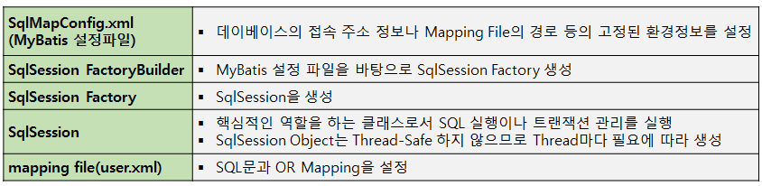

# MyBatis

## MyBatis(마이바티스)란?
MyBatis는 자바 개발자들이 데이터베이스를 쉽게 다룰 수 있도록 도와주는 오픈 소스 ORM(Object-Relational Mapping) 프레임워크이다.

 
### MyBatis의 사용 목적

MyBatis는 데이터베이스 쿼리 <-> 프로그래밍 언어 코드를 분리하여 유지보수성과 생산성을 높이는 것이다.

 ### MyBatis(마이바티스) 특징 1

MyBatis는 SQL을 별도의 파일로 분리해서 관리하고, 객체-SQL 사이의 파라미터 Mapping 작업을 자동으로 해준다.
MyBatis는 개발자가 익숙한 SQL을 그대로 이용하면서 JDBC 코드 작성의 불편함도 제거하여 도메인 객체나 VO 객체를 중심으로 개발이 가능하다는 장점이 있다.

* Domain Object (도메인 객체) - 개발하고자 하는 영역을 분석하고, 그 분석의 결과로 도출된 객체들을 의미
* Value Object (VO 객체) - DTO의 읽기 버전 (VO는 출력 : Read Only)

### MyBatis(마이바티스) 특징 2 

1. 쉬운 접근성과 코드의 간결함 - 가장 간단한 퍼시턴스 프레임워크이다. XML 형태로 서술된 JDBC 코드라고 생각해도 될 만큼 JDBC의 모든 기능을 MyBatis가 대부분 제공하고 있다.
복잡한 JDBC코드를 걷어내며 깔끔한 소스코드를 유지할 수 있고, 수동적인 파라미터 설정과 쿼리 결과에 대한 맵핑 구문을 제거할 수 있다.
2. SQL문과 프로그래밍 코드의 분리 - SQL에 변경에 있을 때마다 자바 코드를 수정하거나 컴파일하지 않아도 된다.
3.  다양한 프로그래밍 언어로 구현이 가능하다 - Java, C#, .NET, Ruby
 

 #### MyBatis를 사용하여 CRUD 하는 방법 3가지

 1. XML
 2. Java
 3. XML+Java 혼합

MyBatis에서 CRUD 방법 중 XML+Java 혼합 방법이 제일 많이 사용된다.
SQL 매핑을 위한 XML 파일의 사용과 DAO(Data Access Object) 인터페이스 또는 클래스를 위한 Java를 결합한다. 이 접근 방식을 사용하면 XML 파일에서 SQL 쿼리를 정의하고 이를 Java 메서드에 매핑하여 SQL 코드와 Java 코드를 명확하게 구분할 수 있다.

#### MyBatis의 가장 큰 장점 : 동적 쿼리

Dynamic SQL Mapper는 MyBatis와 같은 SQL 매퍼 프레임워크에서 사용되는 개념으로, 런타임 시점에 동적으로 SQL 쿼리를 생성할 수 있는 기능을 제공한다. 이 기능은 특히 조건문, 반복문, 변수 대입 등을 사용하여 유연한 쿼리 생성을 가능하게 한다. 이를 통해 코드의 재사용성과 유지보수성을 높일 수 있다.
 

#### MyBatis의 주요 컴포넌트

SqlSession Factory Builder가 Config File을 읽고 Factory를 생성해준다. 개발자가 DB에 insert하거나 Read하는 메서드를 호출하면 SqlSession Factory가 SqlSession를 생성하고 개발자가 작성한 Application코드에 반환해준다.

SqlSession은 개발자가 작성한 SQL문을 호출해주는 기능을 해준다고 생각하면된다.

(1) Appication에서 SqlSession Factory Builder라고 하는 interface 호출 
(2) SqlSession Factory Builder가 MyBatis Config File 정보를 읽음 
(3) SqlSession Factory Builder가 SqlSession Factory 생성 
(4) 개발자가 Appication에 있는 DB Access하는 READ하거나 INSERT하는 Method를 호출 
(5) SqlSession Factory를 Appication 상에서 호출 
(6) SqlSession Factory가 SqlSession이라는 컴포넌트 생성 
(7) SqlSession을 개발자가 작성하는 Appication Code에 retrun(반환) 해줌 - return 받아서 SqlSession에 있는 Method 호출 
(8) SqlSession은 핵심 기능으로 볼 수 있으며 개발자가 작성한 SQL문(Mapping File)을 호출해줌

###  MyBatis의 주요 컴포넌트의 역할

